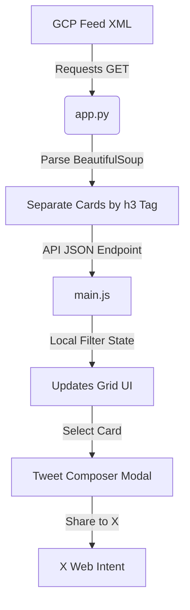

# BigQuery Release Notes Hub 🚀

A premium, glassmorphic web dashboard built using a **Python Flask** backend and a **Vanilla HTML/CSS/JS** frontend. It aggregates, parses, and splits Google Cloud's official BigQuery Atom release notes feed, separating them into individual category cards. Users can filter, search, and customize updates to tweet them instantly on X (Twitter) using an interactive, custom-built composer.

---

## ✨ Features

*   **Granular Parser**: Uses `BeautifulSoup` to split daily release logs into separate cards according to update types (`Feature`, `Issue`, `Changed`, `Deprecated`).
*   **Dual Themes**: Sleek dark space theme (default) and soft light theme, with user choices saved in `localStorage` for persistence.
*   **Performance Cache**: In-memory caching (5-minute expiration) prevents overloading external servers. Paired with a rotating **Refresh Notes** button to force-sync updates.
*   **Instant Search & Filters**: Search cards by keyword or category tags dynamically on the client side without reloading.
*   **X Composer Modal**: Custom-styled share interface featuring:
    *   **Auto-Truncator**: Automatically fits the release description and docs link within X's 280-character boundary.
    *   **SVG Character Gauge**: Dynamic circular character progress ring (changes color from Blue ➔ Amber ➔ Red).
    *   **Hashtag Manager**: Quick buttons to toggle relevant hashtags (e.g., `#BigQuery`, `#GoogleCloud`) without resetting user text changes.
    *   **Clipboard & Intents**: Copy text to the clipboard with custom toast alerts, or post directly using X Web Intent.

---

## 🛠️ Technology Stack

*   **Backend**: Python 3, Flask, requests, BeautifulSoup4 (lxml parser).
*   **Frontend**: Vanilla HTML5, CSS3 (Custom Properties & Keyframe Animations), ES6 JavaScript.
*   **Assets**: FontAwesome 6 (Icons), Google Fonts (`Outfit` for headings, `Inter` for body UI).

---

## 📁 Directory Structure

```text
bq-release-notes/
│
├── app.py                # Flask server, Atom XML parser, & caching controller
├── requirements.txt      # Python dependencies
├── README.md             # Project documentation
├── .gitignore            # Git exclusion rules
│
├── templates/
│   └── index.html        # Main dashboard HTML skeleton & modal markup
│
└── static/
    ├── css/
    │   └── style.css     # Responsive glassmorphic layout & theme properties
    └── js/
        └── main.js       # Client state engine, local search, & X Composer
```

---

## 🚀 Local Setup & Installation

### Prerequisites
Make sure you have **Python 3.x** and **Git** installed on your local machine.

### 1. Clone & Navigate
```bash
git clone https://github.com/NavyaSivakoti/bigquery-release-notes-app.git
cd bq-release-notes
```

### 2. Set Up Virtual Environment
```bash
# Create venv
python3 -m venv .venv

# Activate venv (MacOS/Linux)
source .venv/bin/activate

# Activate venv (Windows)
# .venv\Scripts\activate
```

### 3. Install Dependencies
```bash
pip install -r requirements.txt
```

### 4. Start the Application
```bash
python3 app.py
```

### 5. Access the Web App
Open your web browser and navigate to:
👉 **[http://127.0.0.1:5000](http://127.0.0.1:5000)**

---

## 🔄 How the Data Flows



## 📄 License
Distributed under the MIT License. See `LICENSE` for more information.
